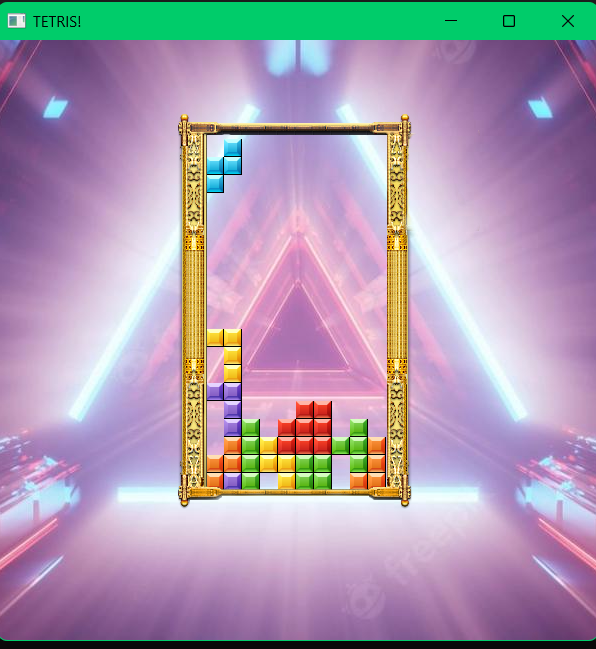
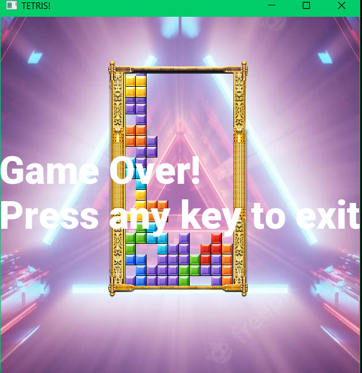

---

## Tetris Game

### Description
This Tetris game is developed using the SFML library in C++. It features the classic Tetris gameplay where players control falling blocks, trying to complete horizontal lines without gaps. The game offers smooth graphics and engaging mechanics, making it an enjoyable experience.

### How to Play the Game
If you just want to play the game without modifying the code, follow these simple steps:

1. **Clone the Repository**:
   - Clone this repository to your local machine using the following command:
     ```bash
     git clone https://github.com/P1Manav/TETRIS_GAME.git
     ```

2. **Run the Game**:
   - Navigate to the `Release` folder in the cloned repository.
   - Double-click on the `tetris.exe` (or `tetris` application file) to start playing the game.

### How to Set Up the Development Environment
If you want to view, modify, or understand the code, follow these steps to set up the development environment:

1. **Clone the Repository**:
   - Clone this repository to your local machine using the following command:
     ```bash
     git clone https://github.com/P1Manav/TETRIS_GAME.git
     ```

2. **Setup Visual Studio**:
   - Make sure you have Visual Studio installed. You can download it from [here](https://visualstudio.microsoft.com/downloads/).
   - Open Visual Studio and clone a new repository directly or open the `.sln` file from the project directory.

3. **Add SFML Library Paths**:
   - In Visual Studio, right-click on the project in the Solution Explorer and select **Properties**.
   - Under **C/C++** > **General**, add the path to the SFML `include` directory to **Additional Include Directories**.
   - Under **Linker** > **General**, add the path to the SFML `lib` directory to **Additional Library Directories**.
   - Under **Linker** > **Input**, add the following libraries to **Additional Dependencies**:
     - For the **Release** configuration, add:
       ```
       sfml-system.lib
       sfml-window.lib
       sfml-graphics.lib
       sfml-audio.lib
       sfml-network.lib
       ```
     - For the **Debug** configuration, add:
       ```
       sfml-system-d.lib
       sfml-window-d.lib
       sfml-graphics-d.lib
       sfml-audio-d.lib
       sfml-network-d.lib
       ```

4. **Build the Project**:
   - Set the configuration to `x86`.
   - Build the project by clicking on `Build` > `Build Solution` or pressing `Ctrl+Shift+B`.

5. **Run the Game**:
   - Run the game by clicking on `Debug` > `Start Without Debugging` or pressing `Ctrl+F5`.

### How to Play
- **Controls**:
  - **Arrow Keys**:
    - **Left**: Move block left
    - **Right**: Move block right
    - **Up**: Rotate the block
    - **Down**: Speed up the falling block
- The objective is to complete horizontal lines without gaps. Completed lines will disappear, giving you points and creating more space for new blocks. The game ends when the blocks stack up to the top of the grid.

### Screenshots

<p align="center">
  
</p>
<p align="center">
  
</p>

---
