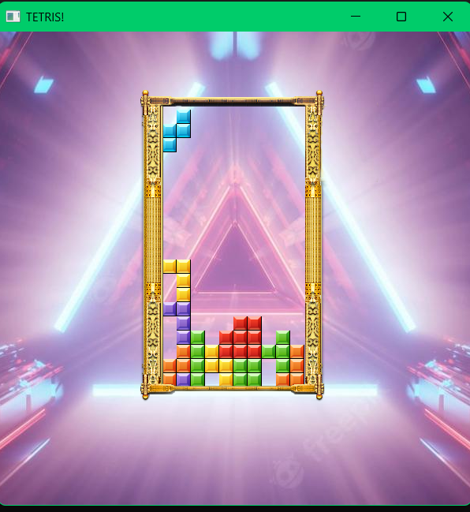
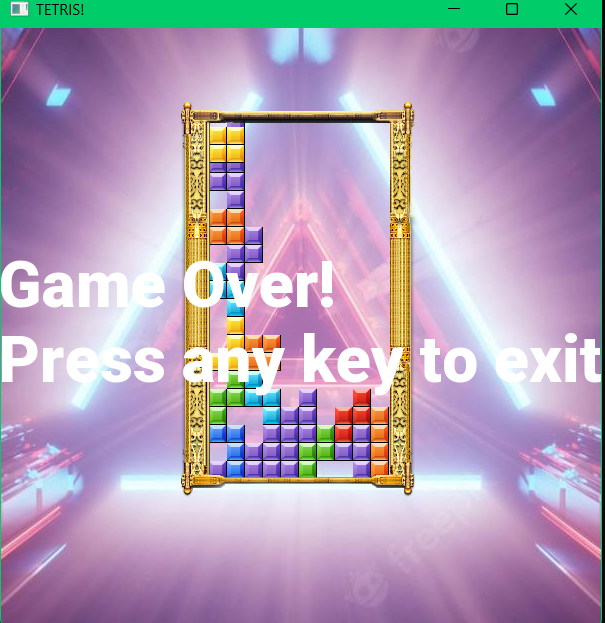

---
## Tron Game

### Description
This Tron game is developed using the SFML library in C++. It is a two-player game where players control their bikes and try to avoid crashing into the trails left by themselves and their opponent. The game features smooth graphics and dynamic gameplay, making it an engaging experience for both players.

### How to Run
1. **Clone the Repository**:
   - Clone this repository to your local machine using the following command:
     ```bash
     git clone https://github.com/P1Manav/TETRIS_GAME.git
     ```
2. **Setup Visual Studio**:
   - Make sure you have Visual Studio installed. You can download it from [here](https://visualstudio.microsoft.com/downloads/).
   - Open Visual Studio and Clone a new repository direct or open the .sin file from the project directory.

3. **Open the Project**:
   - Open the `.sln` file in Visual Studio to load the project.

4. **Run the Project**:
   - Set the configuration to `x86`.
   - Build the project by clicking on `Build` > `Build Solution` or pressing `Ctrl+Shift+B`.

5. **Run the Game**:
   - Run the game by clicking on `Debug` > `Start Without Debugging` or pressing `Ctrl+F5`.

#### How to Play:
- **Controls**:
  - **Arrow Keys**:
    - **Left**: Move block left
    - **Right**: Move block right
    - **Up**: Rotate the block
    - **Down**: Speed up the falling block
- The objective is to complete horizontal lines without gaps. Completed lines will disappear, giving you points and creating more space for new blocks. The game ends when the blocks stack up to the top of the grid.

### Screenshots
<p align="center">
  
</p>
<p align="center">
  
</p>
